# Guide for coreboot to ASUS P8H61-M LX3 PLUS R2.0
I'm happy to write a guide for the first time in my life.

In this tutorial, we'll learn how to replace the motherboard stock firmware with an **open source** firmware.

And I have to say from the beginning of this guide, I'm not responsible for bricked motherboard, burnt rom, thermonuclear war, or you getting fired because of data loss. **All responsibility is YOURS!!**

## First let's explain what coreboot and EDK2 is,
From [coreboot](https://github.com/coreboot/coreboot/blob/main/README.md):
coreboot is a Free Software project aimed at replacing the proprietary firmware (BIOS/UEFI) found in most computers. coreboot performs the required hardware initialization to configure the system, then passes control to a different executable, referred to in coreboot as the payload. Most often, the primary function of the payload is to boot the operating system (OS).

With the separation of hardware initialization and later boot logic, coreboot is perfect for a wide variety of situations. It can be used for specialized applications that run directly in the firmware, running operating systems from flash, loading custom bootloaders, or implementing firmware standards, like PC BIOS services or UEFI. This flexibility allows coreboot systems to include only the features necessary in the target application, reducing the amount of code and flash space required.

From [Tianocore](https://github.com/tianocore/edk2/blob/master/ReadMe.rst): A modern, feature-rich, cross-platform firmware development environment for the UEFI and PI specifications from www.uefi.org.

# Requirements
- A [CH341A Programmer](https://a.co/d/a06cM4g). (I recommend you to use with [USB Extension Cable](https://a.co/d/ehjoGVo))
- [Chip Puller](https://a.co/d/3fNkbOA) (Optional, I removed with 2 small knives (be careful!!))
- Of course an ASUS P8H61-M LX3 PLUS R2.0 motherboard
- Good level of GNU/Linux knowledge
- Basic hardware knowledge
- Another computer running GNU/Linux distro (BTW I use Arch)

### What works
- Sound
- All USB Ports
- Display
- S3 Sleep Mode
- Ethernet
- Windows (don't use that 😛)
- Neutralised Intel ME
- UEFI + Secure Boot
- PCI-e Graphics (see [below](#pcie-graphics))
### Untested
- PS/2 Input
- Hibernation
- Serial Port (in fact, the serial port doesn't even have a port)
### Known bugs
- ~~Sound doesn't work properly on Linux (ALSA issue), but Windows seems fine~~

 Fixed, I created CMOS table and new sound pins, AC'97 setting is now working
- ~~Even if I define the MAC address it doesn't work, I guess someone else experienced it here [too](https://mail.coreboot.org/hyperkitty/list/coreboot@coreboot.org/message/ZVHCIZCB5H6P26CYX22BHZCV64AJVFII/)~~

 Fixed, It reads the MAC address via ERIAR instead of MAC0, so I implemented the ERIAR side.

# Preparing

## Step 1.0: The DIP-8 Thing

 After removing the CMOS battery and power, we'll be comfortable here because our motherboard has a removable socketed BIOS, so that we can easily pull out BIOS and place it in our lovely programmer (look carefully at the small semicircular thing).

 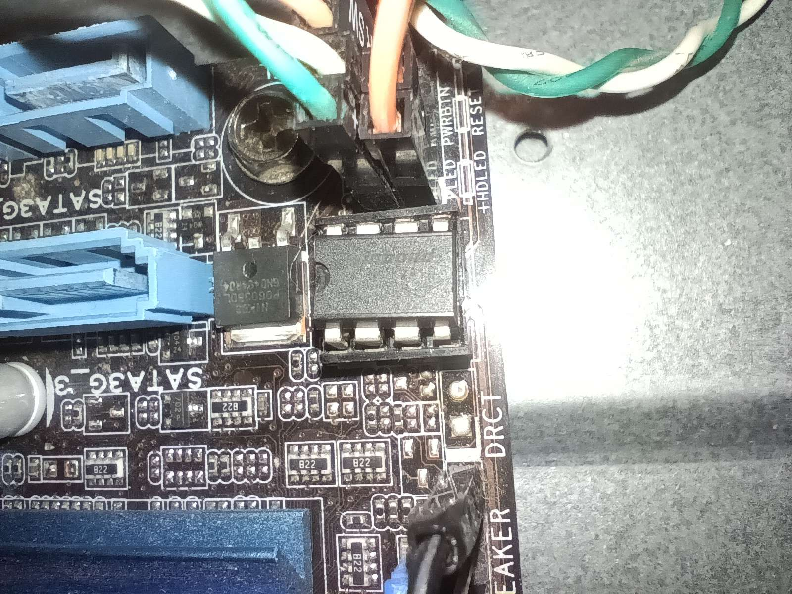
 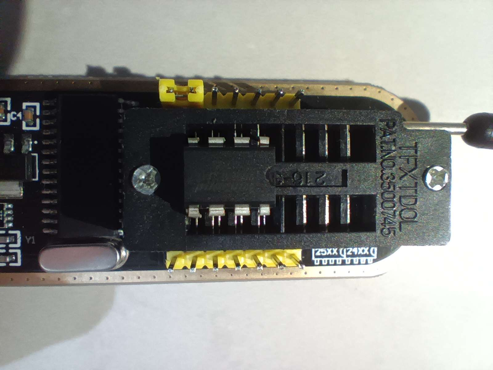
 
 ### 1.1: Backup!

 We need to make a backup in case of any problems (we'll also get some blobs from here).
 
 Firstly, install flashrom on your favourite distro.
 ```sh
 # Debian based distros
 sudo apt-get update && sudo apt-get install -y flashrom
 
 # Arch based distros
 sudo pacman -S flashrom
 ```
 
 Then, we'll have to extract the existing firmware with this.
 ```sh
 sudo flashrom --programmer ch341a_spi -r backup.bin
 ```

 (You can do this 2 times to make sure that the hashes of these two backup roms are same).
 ```sh
 sudo flashrom -c "W25Q64BV/W25Q64CV/W25Q64FV" --programmer ch341a_spi -r backup1.bin
 diff backup.bin backup1.bin
```

 If you get a terminal output like this, you have successfully backed up!
 ```sh
 avsar@archlinux ~$ sudo flashrom -c "W25Q64BV/W25Q64CV/W25Q64FV" --programmer ch341a_spi -r backup.bin                                                                                                                                                                     
 [sudo] password for avsar: 
 flashrom 1.4.0 (git:v1.4.0) on Linux 6.12.1-arch1-1 (x86_64)
 flashrom is free software, get the source code at https://flashrom.org
 
 Found Winbond flash chip "W25Q64BV/W25Q64CV/W25Q64FV" (8192 kB, SPI) on ch341a_spi.
 Reading flash... done.
 
 avsar@archlinux ~$
 ```

## Step 2.0: Coreboot time!

 Firstly, we need to install the necessary dependencies for coreboot
  ```sh
  # Debian based distros
  sudo apt-get update && sudo apt-get install -y bison build-essential curl flex git gnat libncurses5-dev libssl-dev m4 zlib1g-dev pkg-config nasm imagemagick
  
  # Arch based distros
  sudo pacman -S base-devel gcc-ada flex bison ncurses wget zlib git nasm imagemagick
  ```

 ### 2.1: Clone coreboot

  ```sh
  git clone https://review.coreboot.org/coreboot
  cd coreboot
  git submodule update --init --checkout
  ```

 ### 2.2 Create a directory for Intel blobs
 
  ```sh
  mkdir -p 3rdparty/blobs/mainboard/asus/h61-series/
  ```

 ### 2.3 Neutralising Intel ME
 
  Here we'll activate the killswitch using the [HAP AltMeDisable](https://github.com/corna/me_cleaner/wiki/HAP-AltMeDisable-bit) bit and delete *most of* the ME sections

  (You need your backup file to get IFD and ME blobs)
  ```sh
  cd utils/me_cleaner/
  python me_cleaner.py -S -r -t -d -O out.bin -D descriptor.bin -M me.bin ~/backup.bin
  ```

  Move these blobs in the folder we created before
  ```sh
  mv descriptor.bin ../../3rdparty/blobs/mainboard/asus/h61-series/
  mv me.bin ../../3rdparty/blobs/mainboard/asus/h61-series/
  ```

 And we're going back
 
  ```sh
  cd ~/coreboot
  ```

 ### 2.4 Configuration
 
  You can choose the options I show here or you can use the defconfig if you are familiar with it
  ```sh
  make menuconfig


  Mainboard ─>
      Mainboard vendor (ASUS)  --->
      Mainboard model (P8H61-M LX3 R2.0)  --->
      (0x400000) Size of CBFS filesystem in ROM

  Chipset ─>
      [*] Add Intel descriptor.bin file
       (3rdparty/blobs/mainboard/$(MAINBOARDDIR)/descriptor.bin) Path and filename of the descriptor.bin file
      [*]   Add Intel ME/TXE firmware
       (3rdparty/blobs/mainboard/$(MAINBOARDDIR)/me.bin) Path to management engine firmware

  Devices ─>
      Graphics initialization (None)  --->
      Early (romstage) graphics initialization (None)  --->
      [*] Use onboard VGA as primary video device

  Generic Drivers ─>
      [*] Support for flash based, SMM mediated data store
      [*]   Use version 2 of SMMSTORE API

  Payload ─>
      Payload to add (edk2 payload)  --->
        (build/UEFIPAYLOAD.fd) edk2 binary
        EDK II build type (Build UefiPayloadPkg)  --->
        Tianocore's EDK II payload (MrChromebox' edk2 fork)  --->
        (https://github.com/mrchromebox/edk2) URL to git repository for edk2
        (origin/uefipayload_202309) Insert a commit's SHA-1 or a branch name

      [*]   Use Escape key for Boot Manager
      [*]   Use the full screen for the edk2 frontpage
      [*]   Enable UEFI Secure Boot support
      [*]   Add a GOP driver to the Tianocore build
      (IntelGopDriver.efi) GOP driver file
      (-D VARIABLE_SUPPORT=SMMSTORE) edk2 additional custom build parameters
  ```
  Exit and save the config. You can check it by typing `make savedefconfig`.

 ### 2.5 Extract the GOP Driver from Firmware
 
  Remember the backup we made, shown in 1.1? Yep. Now we'll get the GOP driver from there so that the display can work.

  Install [UEFITool](https://github.com/LongSoft/UEFITool/releases/download/A68/UEFITool_NE_A68_x64_linux.zip) and open the backup firmware

  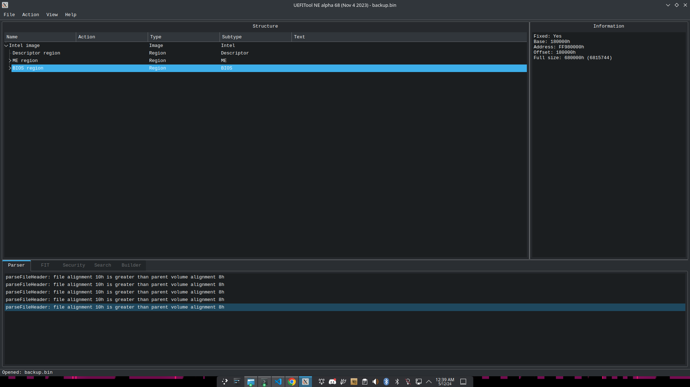

  Then, press CTRL+F and go to the text tab and type `Intel(R) Gop Driver`

  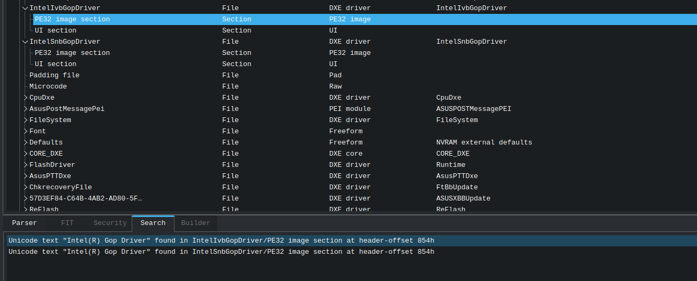

  As you can see, there are 2 inputs here, Ivb and Snb, I choose the Ivb one because my processor is Ivy Bridge

  Then, right click on the PE32 image file, select Extract Body and change the name to IntelGopDriver.efi and move it to the main directory of coreboot

 ### 2.6 Build coreboot
 
  ```sh
   make crossgcc-i386 CPUS=$(nproc)
   make iasl
   make -j$(nproc)
  ```

  You should get an output similar to this after compilation
  ```sh
   FMAP REGION: COREBOOT
   Name                           Offset     Type           Size   Comp
   cbfs_master_header             0x0        cbfs header        32 none
   fallback/romstage              0x80       stage           92464 none
   cpu_microcode_blob.bin         0x16a40    microcode       26624 none
   fallback/ramstage              0x1d280    stage          100103 LZMA (221464 decompressed)
   config                         0x35a00    raw              3215 LZMA (10063 decompressed)
   revision                       0x366c0    raw               727 none
   build_info                     0x369c0    raw               111 none
   fallback/dsdt.aml              0x36a80    raw              8991 none
   rt8168-macaddress              0x38e00    raw                17 none
   vbt.bin                        0x38e40    raw              1248 LZMA (7168 decompressed)
   fallback/postcar               0x39380    stage           23352 none
   fallback/payload               0x3ef00    simple elf    1307411 none
   (empty)                        0x17e240   null          2280292 none
   bootblock                      0x3aadc0   bootblock       20480 none
   
   Built asus/h61-series (P8H61-M LX3 R2.0)
   avsar@archlinux ~/coreboot$             
  ```

## Step 3.0: Flash!

 Now we need to flash the compiled file.
 ```sh
 sudo flashrom -c "W25Q64BV/W25Q64CV/W25Q64FV" --programmer ch341a_spi -w build/coreboot.rom
 ```

 If everything is fine, you should get an output like
 ```sh
 avsar@archlinux ~/coreboot$ sudo flashrom -c "W25Q64BV/W25Q64CV/W25Q64FV" --programmer ch341a_spi -w build/coreboot.rom
 [sudo] password for avsar:
 flashrom 1.4.0 (git:v1.4.0) on Linux 6.12.1-arch1-1 (x86_64)
 flashrom is free software, get the source code at https://flashrom.org
 
 Found Winbond flash chip "W25Q64BV/W25Q64CV/W25Q64FV" (8192 kB, SPI) on ch341a_spi.
 Reading old flash chip contents... done.
 Erase/write done from 0 to 7fffff
 Verifying flash... VERIFIED.

 avsar@archlinux ~/coreboot$
 ```
 Disconnect the USB connection (definitely do it first), take the chip and insert it into the motherboard as in [1.0](#step-10-the-dip-8-thing).

## Step 4.0: Test time!

 If you saw a nice rabbit logo when the computer booted up, yep everything works. (sorry for the bad quality).

 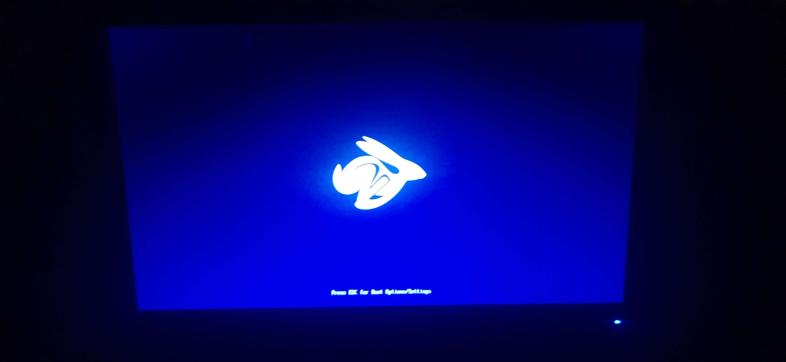

 After that you'll need to put your favourite bootloader in first boot order and run it.

 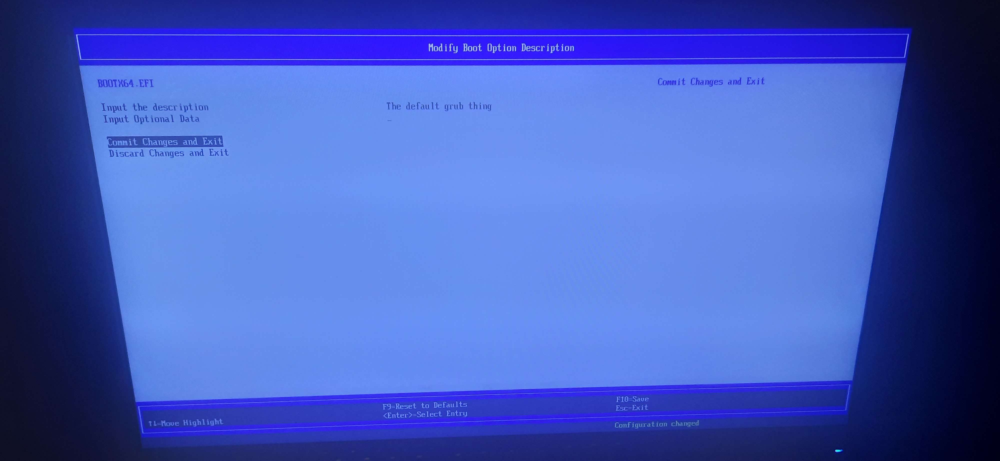

 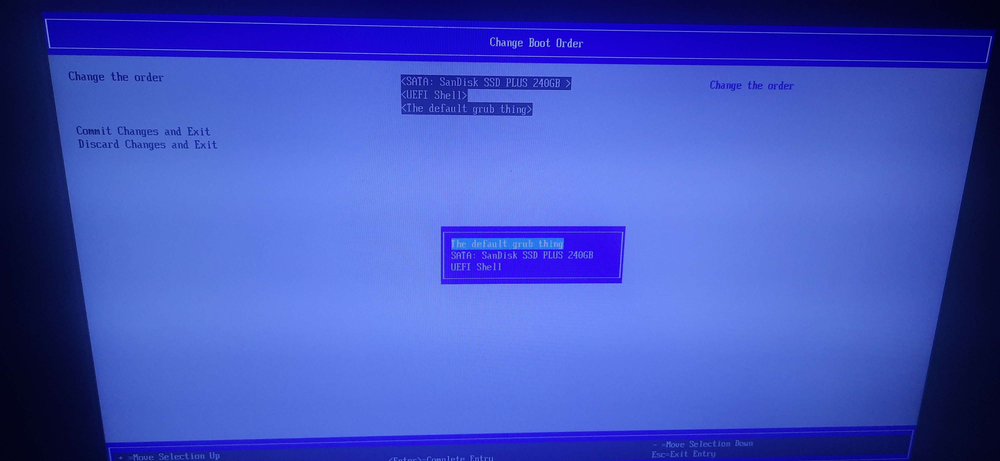

 Save and reboot and you'll get a nice bootloader screen 😸

 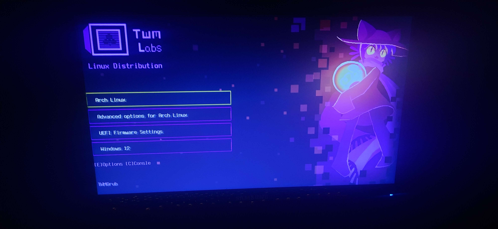

 The rest is up to you... and these are my OS screenshots.

 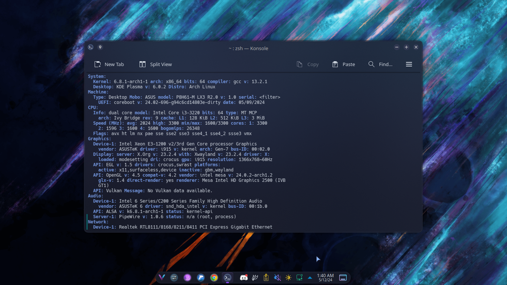
 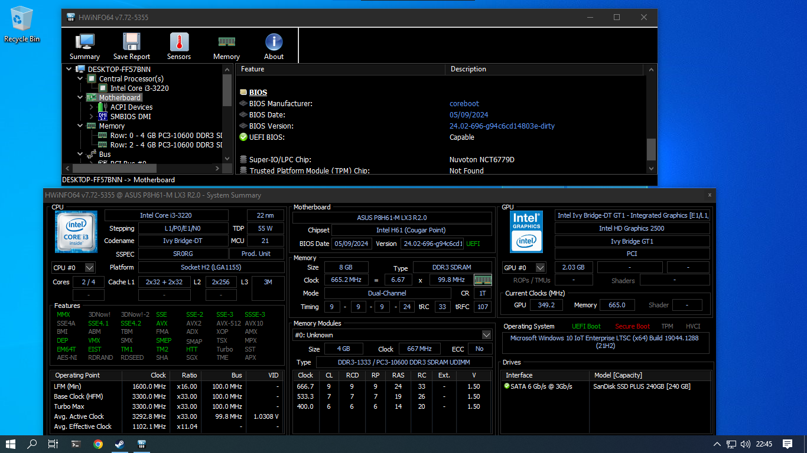

# Tips and tricks

## PCIe Graphics
 
 I talked to ellyq on Discord 2 days before updating this guide, she said she merged PCIPlatformDxe support into her own EDK2 fork, so I tried it and it really worked, many thanks!

 For this you'll need a graphics card that supports GOP, you can find it by using GPU-Z or searching on [TechPowerUp](https://www.techpowerup.com/vgabios/)
 (*in fact, almost all cards above 2012 have this support*)
 
 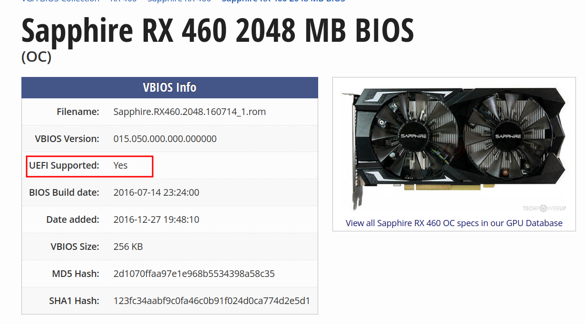
 
 Rather than the configurations in [2.4](#24-configuration), you'll need to do these separately;
 
 ```sh
 make menuconfig

  Devices ─>
      Graphics initialization (Run VGA Option ROMs)  --->
      [ ] Use onboard VGA as primary video device
      [*] Re-run VGA Option ROMs on S3 resume
	  [*] Load Option ROMs on PCI devices
   Payload ─>
      Payload to add (edk2 payload)  --->
      Tianocore's EDK II payload (Specify your own repository)  --->
      (https://github.com/ellyq/edk2) URL to git repository for edk2
	  (uefipayload_2408) Insert a commit's SHA-1 or a branch name
      (-D VARIABLE_SUPPORT=SMMSTORE -D LOAD_OPTION_ROMS=TRUE -D SECURE_BOOT_ENABLE=TRUE) edk2 additional custom build parameters
 ```
 <table>
   <tr>
     <td>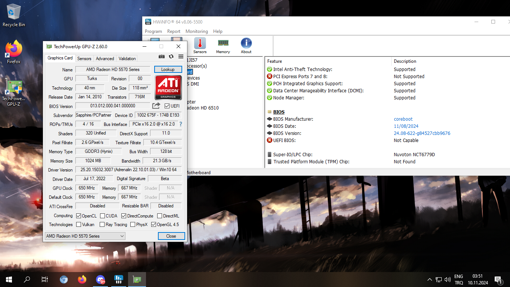</td>
    <td>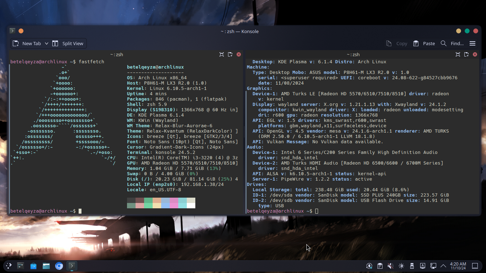</td>
   </tr>
 </table>

 For those asking "How does a 16yo video card support GOP??”, here's a [guide](https://winraid.level1techs.com/t/amd-and-nvidia-gop-update-no-requests-diy/30917) 	😊

## Speaker TIME!

 Did you miss the opening sound? Yeah, we'll do something similar.
 Go to src/mainboard/asus/h61-series/mainboard.c and add these things and go back to [step 2.6](#26-build-coreboot)
 ```diff
 --- a/src/mainboard/asus/h61-series/mainboard.c
 +++ b/src/mainboard/asus/h61-series/mainboard.c
 @@ -2,6 +2,12 @@
  
  #include <device/device.h>
  #include <drivers/intel/gma/int15.h>
 +#include <pc80/i8254.h>
 +
 +static void mainboard_final(void *unused)
 +{
 +       beep(1500, 100);
 +}
  
  static void mainboard_enable(struct device *dev)
  {
 @@ -12,4 +18,5 @@ static void mainboard_enable(struct device *dev)
  
  struct chip_operations mainboard_ops = {
         .enable_dev = mainboard_enable,
 +       .final = mainboard_final,
  };
 ```

## Getting MAC address from backup BIOS

 **IMPORTANT**: You'll need to use [my fork](https://github.com/lustryrose882/betel-coreboot-playground) to make this work.

 We'll use uefitool here too, just like in [2.5](#25-extract-the-gop-driver-from-firmware).

 Go to the GUID tab through the search and type "FD44820B-F1AB-41C0-AE4E-0C55556EB9BD"
 
 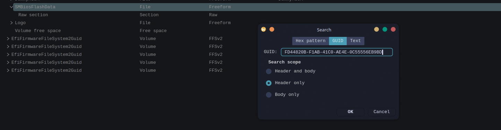

 Then select Raw section and press Ctrl+D

 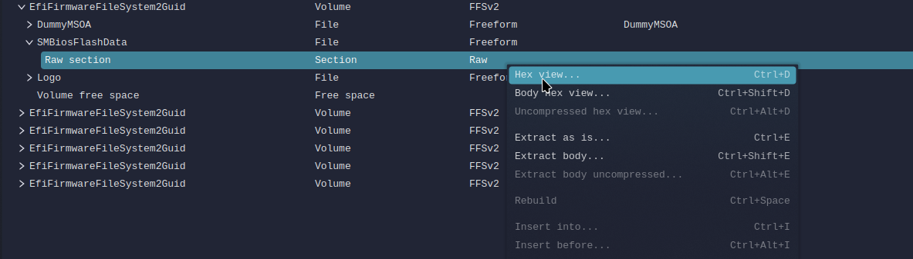

 Look carefully at the text view where it says 08606EXXXXXX, it will be your MAC address. (08-60-6E is owned by ASUSTek COMPUTER INC.)
 
 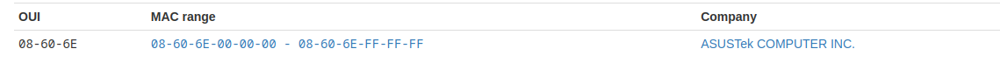

 For example it could be 08606E3F2DE1, it will be different on each device, be careful about this!

 Take it in xx:xx:xx:xx:xx:xx format and add it here;

 ```sh
 make menuconfig

 Generic Drivers ─>
  (08:60:6e:3f:2d:e1) Realtek rt8168 mac address
 ```
# Last words
 I've been trying to make this tutorial for about 4 + 2 (10.11.2024) hours.

 Actually, I didn't want to do it at first, but my friends asked me to add it, so I did some work and prepared a nice guide.

 Thank you to the whole coreboot team, Corna for the me_cleaner project, MrChromebox for his help and his excellent EDK2 project and ellyq for her help.
